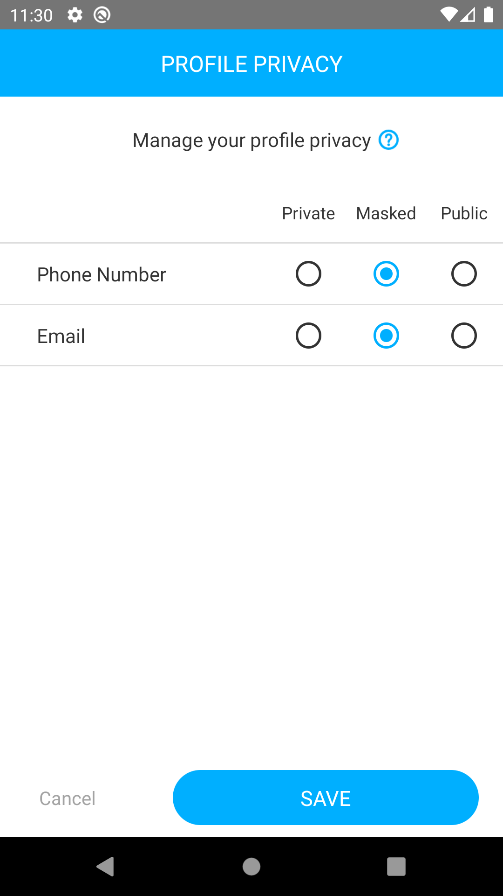
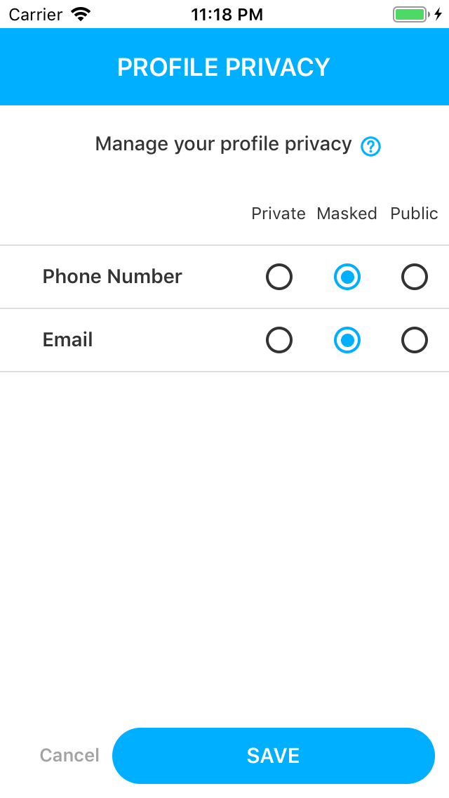
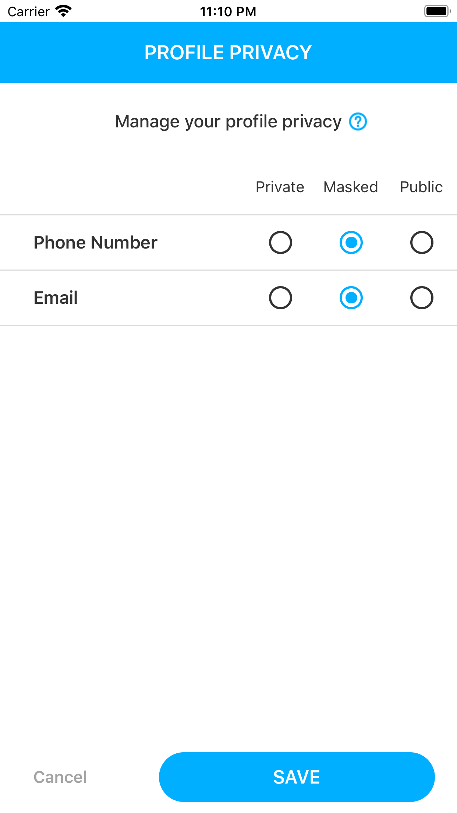
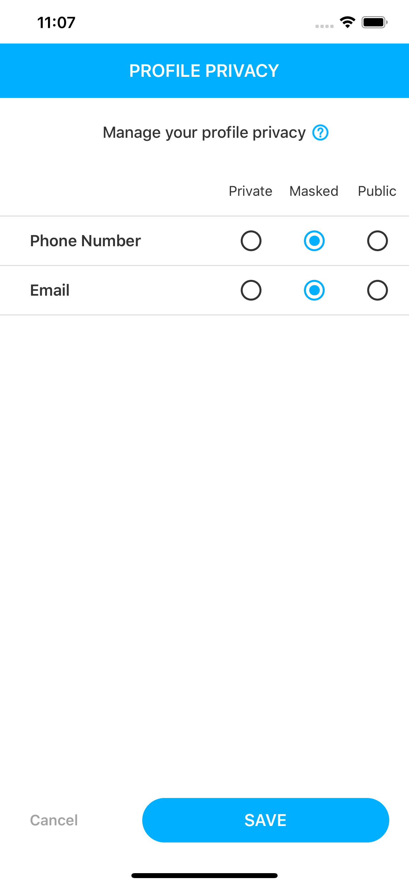
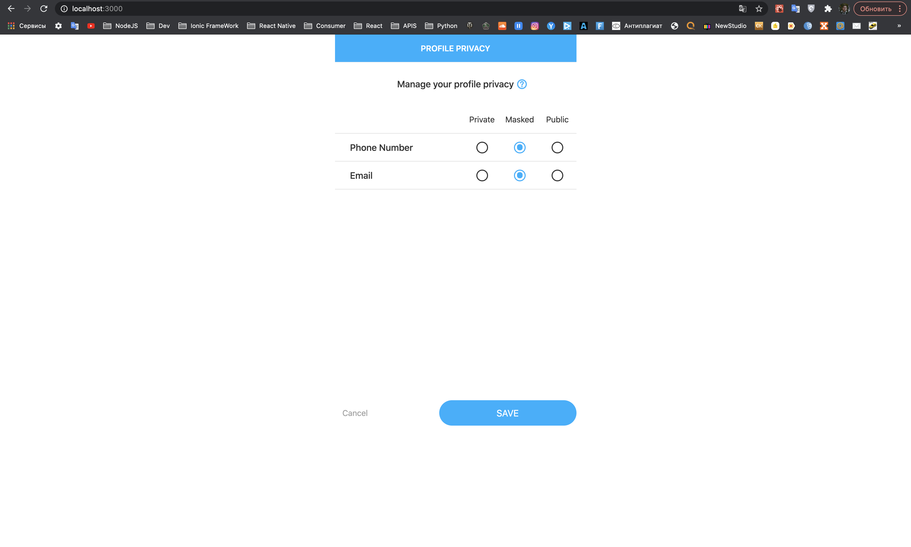
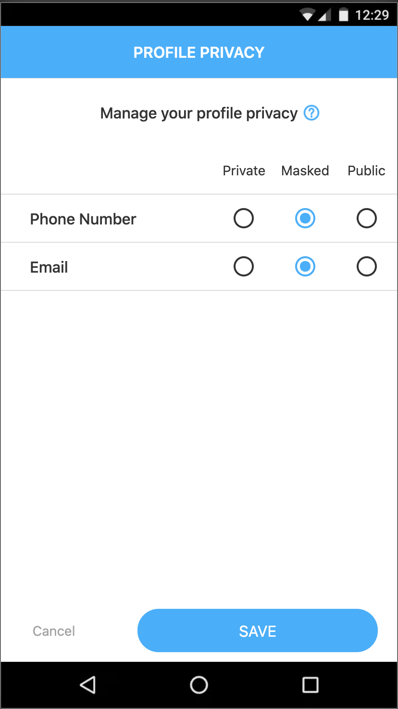

## Test Assignment: Middle ReactNative developer for GoodDollar
____
## React Native Web with TypeScript 
____
#### For responsive layout used:
* custom DeviceSize.pass() util
* custom DeviceSize.select() util
* isDeviceS, isDeviceM, isDeviceL, isDeviceXL variables
* general screen size (s = [<340], m = [340><450], l = [450><1024], xl = [1024>])

#### Why exactly this screen sizes?
* size **S** - iPhone SE, iPhone 4-5, small Android device
* size **M** - iPhone 6-8, middle Android device
* size **L** - iPhone X-12, iPad Mini-Pro, large Android device, tablets
* size **XL** - laptop, pc, browser size

#### For cross platform layout used:
* different filenames (name.web.ts, name.android.ts, name.ios.ts) for specific platforms
* Platform.OS util from React Native core
* Platform.select() util from React Native core
* isWeb, isAndroid, isIOS variables

Display of Examples:
 ------------
## Android (Google Pixel 2), etc

## iPhone SE, iPhone 4, etc

## iPhone 6, 7, 8, etc

## iPhone X, 11, 12, etc

## Laptop, Desktop, Browser, etc

## Mobile Browser

